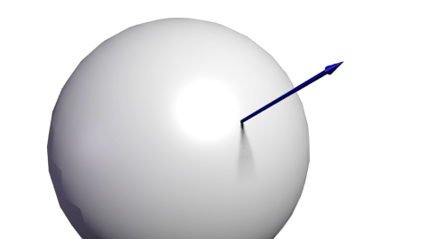

# 切线空间 

切线空间(Tangent Space)它是由顶点所构成的平面的UV坐标轴以及表面的法线所构成一般用T(Tangent),B(Bitangent),N(Normal)

## 图解如何构建切线空间

||
||

## 引用

(http://www.opengl-tutorial.org/intermediate-tutorials/tutorial-13-normal-mapping/)
	
	
	
	
	
	
	
	
	
	
	
	
	
	
	
	
	
	
	
	
	