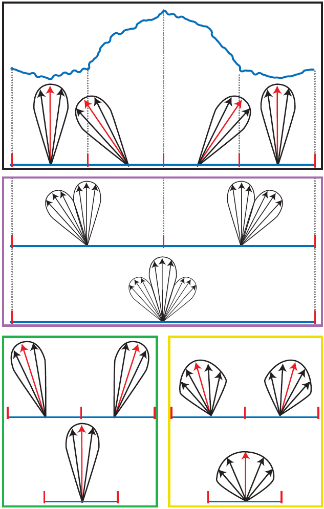

# 法线贴图 

## 首先默认已经知道什么是法线以及法线贴图的基本概念

一般法线贴图都是存储在切线空间。
简单的来说，切线空间可以理解为纹理空间的u，v方向和法向量n，这3个方向构成了切线空间，一般使用T、B和N表示
(http://blog.csdn.net/bonchoix/article/details/8619624)

##法线贴图的压缩和mipmap

### 压缩

归一化的法线长度为1，且在切线空间下，法线的z分量不可能为负数，所以只需要存储x和y值即可。
传统的纹理压缩方法如DXTC等，不能直接对法线贴图使用.

在实时渲染中一般采用DXTC及其改进方法由于法线贴图存储的数据并不是RGB信息而是法线方向，
所以需要在一般纹理压缩的方法的基础上进行一定的改变.
在支持DirectX10的显卡上，可以使用BC5格式进行压缩。
>BC5
不支持DirectX10的显卡，可以使用DXT5格式进行压缩
将法线的x和y值存储到纹理的alpha和Green通道即可。之所以是存储到这两个通道，而非其他通道，
这是因为每个DXT5中每个Block选择的两个参考像素alpha通道有8Bit，RGB通道分别为5、6、5Bit，所以使用alpha和Green通道可以获得较高精度。

### MipMap

使用传统mipmap方法生成的法线贴图对于漫反射表面基本没问题，但是在镜面表面会导致严重的视觉问题。
对于漫反射表面来说，光照的计算公式为l·n，l为光线方向的相反方向，n为法线，
l·n1 + l·n2 + l·n3 + l·n4 = l·(n1 + n2 + n3 + n4) / 4，
而mipmap则是事先计算(n1 + n2 + n3 + n4) / 4，所以对于漫反射表面，对法线贴图使用传统方式的mipmap基本没问题。
为什么是基本没问题而不是完全没问题呢？因为这里存在一个近似，若l·n < 0，则光照值为0（光照不能为负），若将这个因素考虑进去，漫反射表面也会有问题，
不过在实际当中这种情况表现不明显，所以可以认为基本没问题。
对于镜面表面来说，当视线偏离反射光线方向的时候，光照强度会急剧下降，反映在公式中是因为其含有cosm(h·n)项而漫反射光照是线性变化，
所以对于镜面表面，不能使用传统方法生成法线贴图的mipmap，需要特殊处理。
·图中有4个像素，每个像素有法线和镜面反射波瓣（红色的是法线，周围一圈是镜面反射波瓣，镜面反射波瓣用于表示不同方向的反射强度）
·图2中间部分，表示正确的mipmap情况，分别从4个像素合并为2个像素，从两个像素合并为1个像素。
而现有的方法中，没有方法可以做到这样的mipmap，所以只能用其他方法进行近似。
·底部左图，是使用一般纹理的mipmap方法对法线进行平均，可以看到这种方法产生出的镜面反射波瓣和正确的镜面反射波瓣差距很大，
其根本原因是使用线性方法对非线性的参数进行计算。底部图右图，每次在平均法线的同时，改变表面的光泽度（即改变镜面光公式中的m），
虽然最终结果与正确的mipmap有一些差距，但是比一般纹理的mipmap的方法要好很多。

所以，对法线贴图的mipmap方法之一，就是在使用一般纹理的mipmap方法对法线进行平均的同时，每张mipmap都必须附带一张光泽贴图（gloss map）
，记录每个像素点的光泽度（即m），m的计算原则就是让最后的镜面反射波瓣与正确的镜面反射波瓣最接近。当然，还有其他很多方法能得到不错的结果，具体可以参看《Real-Time Rendering 3rd》，或去搜索相关论文。

### 引用及参考
摘抄自。涉及到几个不常关注的关于法线贴图的点。
(https://www.cnblogs.com/wangchengfeng/p/3475489.html)