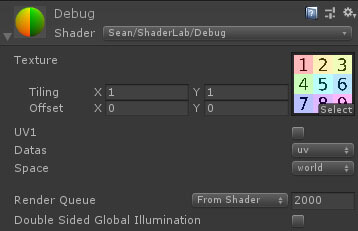

# ShaderLab <color="yellow">(Alpha)</color>

着色器实验室
整理并处理有关Shader的一切。
## 简介 
Shader是Unity中生僻知识比较集中的部分。
大量的信息和知识，难记难学难用。
这个项目的核心目的是降低写Shader的复杂度。减少重复劳动，帮助记忆。
不同于美术用基于节点的Shader编辑器。这个项目时帮助直接写代码的。我始终认为算法本身才是着色器最重要的。
同时这个项目中将包含大量文档和辅助工具。帮助学习和记忆知识。
## 更新说明
>Version

## 文献
有太多文字和知识，很难把他们都清楚记住。
因此这个专栏中，将收集和整理关于Shader各种知识。
>Article/ArticleIndex
## Debug 
调试是最重要的功能。所有的问题都应该有对应覆盖的测试流程。
最理想的情况下。跑完测试用例应该可以找到错误的原因。
调试Shader提供了各种基础数据的直接展示。

>Debug/DebugIndex

## 标准化
标准化专注提供一套衡量指标。
这样只要满足这套指标的Shader就可以在统一的规则下使用而不用过多的修改。
>Standardization

## MaterialAnimator <color="red">(Obsolete)</color>

运行时材质动画控制器。

>MaterialAnimator
## ShaderLibrary <color="red">(Internal)</color>

### 需要CodeTemplate插件。
Shader生成器。
生成Shader模板。
通过可视化操作为Shader添加代码，主要是添加常用数据结构。
通过不断添加代码模板增加 降低写Shader的复杂度。

>ShaderLaboratory/Index
