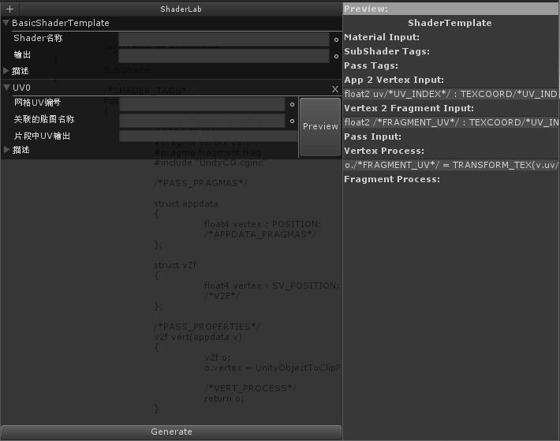

# ShaderLibrary <color="orange">(Preview)</color>

## Shader 生成器

可视化生成代码。
与一般的节点编辑器不同。
这个生成器按照功能进行分块。
通过大量模板相互组合生成一个shader基础框架。

## ShaderTemplate 模板

基本就是一个Shader的空架子。
考虑到Shader有很多不同的封装方法。
扩展这个模板或者直接拷贝生成的代码才是合理的。

## ShaderElements 元素

Shader中每一个功能元素。
在生成器中添加元素。即按照功能查询相应的代码。
每一个元素都会标明，在不同阶段中的Shader代码。
考虑到灵活性。所有元素之间的关联都要手动完成。

>ShaderElements

### KeyWord 关键字

可定制的内容通过关键字在模板中定位
在/*...*/中的关键字 表示这个关键字是需要外部输入的。
查询文档或者自己看逻辑填充这些关键字。

## Preview 预览

显示Shader不同阶段代码。复制到自己的Shader中改写。

## 使用方法

1·用任何工具创建自己的Shader文件。
2·打开ShaderLab窗口选择一个Shader模板。
3·添加希望有的Shader元素 比如法线/贴图/Color等。
4·填充元素中的关键字。
5·点击preview/generate 生成Shader代码。
6·复制代码到Shader文件中对应的代码段。